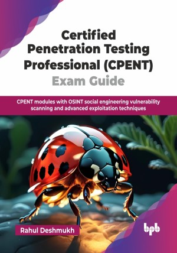

# Certified Penetration Testing Professional (CPENT) Exam Guide

CPENT modules with OSINT social engineering vulnerability scanning and advanced exploitation techniques.

This is the repository for [Certified Penetration Testing Professional (CPENT) Exam Guide
](https://bpbonline.com/products/certified-penetration-testing-professional-cpent-exam-guide?_pos=1&_sid=65126613d&_ss=r&variant=44774195658952?variant=44774195658952),published by BPB Publications.

## About the Book
There has been a rise in demand for cybersecurity professionals who can identify vulnerabilities proactively in applications and infrastructure and offer their skills and expertise in the form of remedial actions to plug these vulnerabilities. CPENT is one such examination testing the skills and expertise of a penetration testing professional and offers a global, coveted certification to those who clear this examination.

This guide walks you through each CPENT domain in a sequential and easy-to-understand format. You will begin with learning how to plan for the exam and prepare your system environment. It then covers critical techniques like Open-Source Intelligence (OSINT), social engineering attacks, vulnerability scanning, and tool usage. You will also explore advanced topics such as privilege escalation, binary exploitation, malware detection, and post-exploitation strategies. The book also teaches you how to document and submit professional pentest reports and includes realistic mock exams to prepare you for the real test environment.

By the end of this book, you will have the skills to perform penetration testing, gather intelligence from various sources, perform social engineering penetration testing, perform penetration testing on IoT, wireless, cloud based systems, advanced exploitation techniques and various tools and techniques to be used for penetration testing. 

## What You Will Learn
• Learning different modules to prepare for the CPENT exam.

• Pre-requisites for system and CPENT exam preparation.

• Understanding and learning tools and techniques for penetration testing.

• Learning about the Cyber Kill Chain process.

• Conducting penetration testing on network and web applications.

• Penetration testing methods for IoT, SCADA, cloud assets, and various strategies.

• Drafting and submitting a report for certification.
